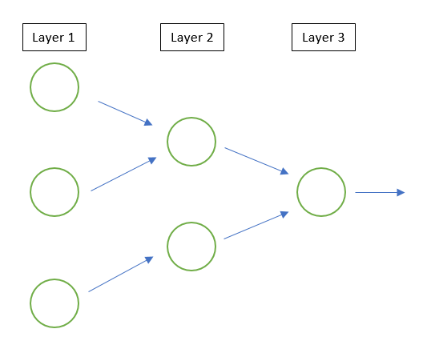

# neuron
A Python library for building simple neuron models.

## Overview
There are 4 main classes which users can manipulate:
#### 1. Inputs
Input Neurons output a predetermined constant value along a connection. They cannot recieve input values and do not compute any outputs.
#### 2. Neurons
Neurons recieve input values and compute an output based on the specifics of the chosen neuron model.
#### 3. Layers

Layers are a tool for graphically organizing the layout of Neurons. When running a model, the neurons in Layer 1 read their input, compute an output, and use it to populate the inputs of connected neurons in the next layer, and so on. 
#### 4. Networks
A network is a canvas you can use to add Layers, Neurons, and Inputs to create more complex networks of neurons. 
## Types of Neurons
#### 1. McCulloch-Pitts
#### 2. Integrate and Fire
#### 3. Leaky Integrate and Fire
## Reference
